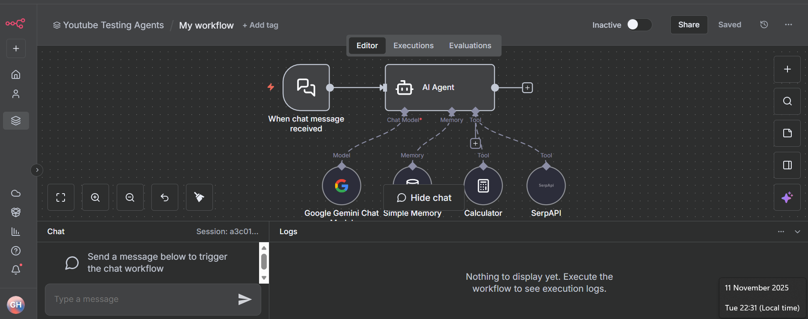

AI Agent Chat Workflow (n8n + LangChain + Gemini)

This project contains an \*\*n8n automation workflow\*\* integrating LangChain with Google Gemini, SerpAPI, and other AI tools.  

It responds to chat inputs using an AI agent with memory, computation, and real-time web search capabilities.

Components Used

\- Chat Trigger (to start on new messages)

\- AI Agent (LangChain-based reasoning)

\- Google Gemini Chat Model (for conversation)

\- SerpAPI (for web data)

\- Calculator (for computations)

\- Memory Buffer (for short-term context)

How to Import

1\. Open your n8n dashboard.

2\. Go to \*\*Import Workflow\*\*.

3\. Upload the file `My workflow.json`.

4\. Add your credentials for Google Gemini and SerpAPI.

5\. Activate and test the workflow.
Demo

You can see the n8n workflow layout below:

---
Future Enhancements
- Integrate custom tools (like database lookup or Slack integration)
- Add persistent memory using Redis or Postgres nodes
- Deploy the workflow on an n8n server or Docker for continuous automation

Author: Gaganashree H N

